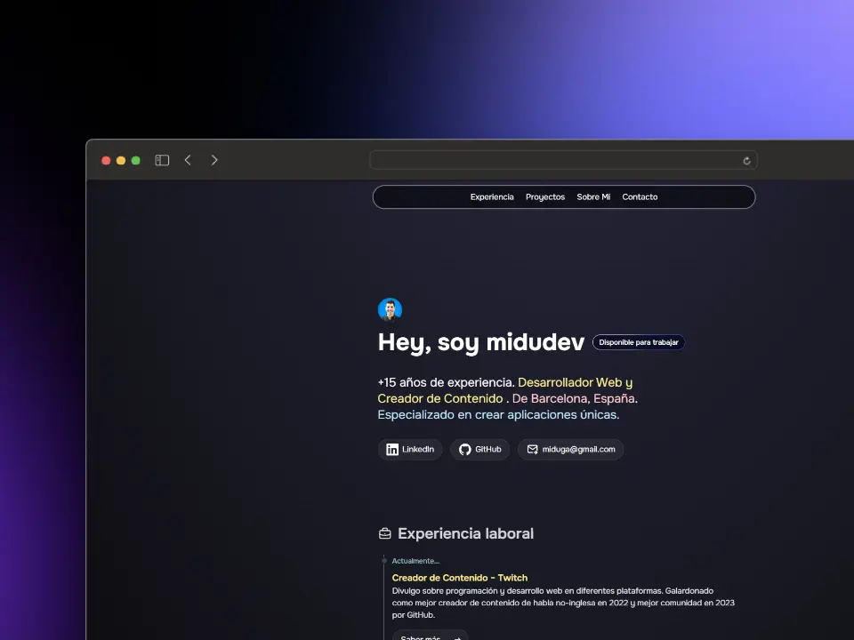

Portfolio for programmers and developers.
Cloned and adapted from [midudev/porfolio.dev](https://github.com/midudev/porfolio.dev)

Live version available at https://clarriu97.github.io/

# Local development

⚠️ **This project uses pnpm as its package manager**

- Install pnpm (if you don't have it):

  ```bash
  npm install -g pnpm
  ```

- Install dependencies:

  ```bash
  pnpm install
  ```

- Start the dev server:

  ```bash
  pnpm start
  ```

- Build the app:

  ```bash
  pnpm build
  ```

# 👨🏻‍💻 Portfolio for programmers and developers

<div align="center">
<a href="https://porfolio.dev/">

</a>
<p></p>
</div>

<div align="center">


</div>

## 🫂 Contributors

<a href="https://github.com/midudev/porfolio.dev/graphs/contributors">
  
</a>

<p></p>
