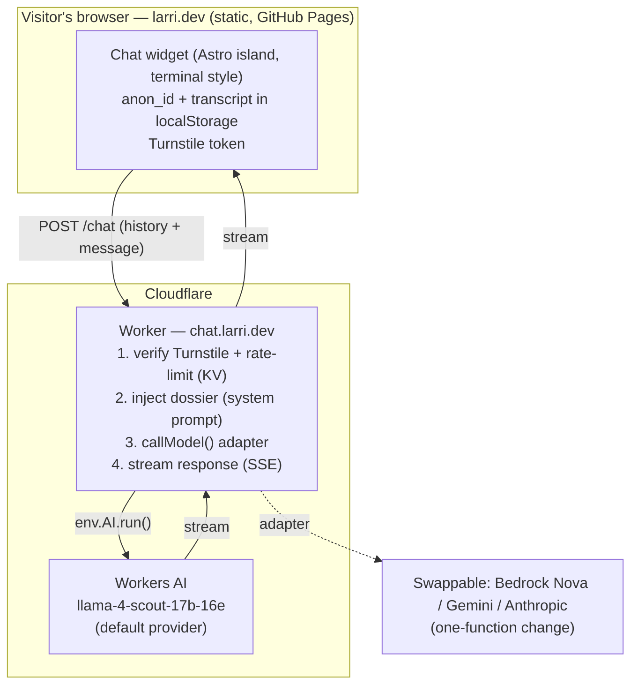

# Conversational Agent for larri.dev — Architecture & Decisions

- **Status:** Implemented — MVP + hardening (Turnstile + rate limiting) live and
  verified end-to-end. Remaining manual setup: create the KV namespace and a real
  Turnstile widget (see `worker/README.md`).
- **Date:** 2026-07-20 (last updated 2026-07-21)
- **Owner:** Carlos Larriu
- **Related:** [../README.md](../README.md)

This document records how we framed the problem, the options we considered, the
decisions we took, and *why*. It is intentionally opinionated: the goal is that
future-us can re-open a decision knowing the reasoning behind it, not re-derive it
from scratch.

---

## 1. Goal

Add a chat widget to larri.dev that answers questions about Carlos — background,
experience, projects, skills — with the right context, sensible guardrails, and a
single persistent conversation per visitor. It should feel native to the site's
existing terminal aesthetic (boot sequence, `Cmd+K` palette, aurora background).

**One-line framing:** *a small, cheap, well-guarded "ask me anything about Carlos"
box that can't be turned into a free general-purpose chatbot or a cost bomb.*

---

## 2. Requirements

**Functional**
- Answers questions about Carlos using curated context (bio, roles, projects, skills).
- Refuses / redirects anything off-topic (not a general assistant).
- Streams responses (feels live, matches the terminal vibe).
- **Single conversation per visitor.** If they've chatted before, they resume the
  same thread. They can *continue* or *delete* — never open multiple chats.

**Non-functional / constraints**
- **Cost:** as close to **$0/month** as possible. Explicitly not willing to spend
  even a few dollars/month for the expected traffic.
- **No login / no accounts.** "Returning visitor" detection must be anonymous.
- **Persistence:** `localStorage` (decided — see §8).
- **Secrets never reach the browser.**
- Minimal moving parts and minimal disruption to the current deploy.

**Current stack (grounding facts)**
- Astro 4.4.5, **fully static** — no SSR adapter (`astro.config.mjs`).
- Built with `astro build`; deployed to **GitHub Pages** via GitHub Actions
  (`peaceiris/actions-gh-pages`, see `.github/workflows/deploy.yml`).
- Domain `larri.dev`, with **Cloudflare in front (DNS/proxy)**.
- Existing UX assets we can reuse: terminal boot sequence, `Cmd+K` command palette
  (`src/components/CommandPalette.astro`), aurora Three.js background.

> Note: the repo currently deploys to GitHub Pages, **not** Cloudflare Pages, even
> though Cloudflare fronts the domain. This matters for §4.

---

## 3. Decision — Do we even need a backend? (Yes.)

**Question raised:** *Can't I just put the API key as an env var / GitHub Actions
secret and use it at deploy time, avoiding a backend entirely?*

**Answer: no — and understanding why frames the whole architecture.**

- GitHub Actions runs at **build time**: once, on GitHub's runner, when you push. It
  emits static files and uploads them.
- The chat happens at **runtime**, in the **visitor's browser**, long after the build.
  GitHub Actions is not running then.
- For the browser to call a model, the credential would have to be **baked into the
  shipped JavaScript**. Anyone can read it via DevTools → Network/Sources. A CI secret
  is only secret *while CI runs*; inline it into the bundle and it stops being secret.

Therefore a **server-side execution point that holds the secret and runs per request**
is unavoidable for a public site. But that is **not** a 24/7 server — it is a
**serverless function** (a Cloudflare Worker), ~30 lines, effectively free.

**Two consequences that shaped later decisions:**
- **AWS/Bedrock makes the backend *more* necessary, not less.** AWS credentials are
  far more sensitive than an LLM key (they can touch the whole AWS account) and
  Bedrock signs requests with SigV4, which needs the secret. They must never touch the
  browser.
- **Cloudflare Workers AI removes the *external* key entirely.** The model runs inside
  Cloudflare and is invoked via a binding (`env.AI.run(...)`) — there is no third-party
  API key to store or leak. You still need the Worker, but secret management drops to
  zero.

**Decision:** a single **Cloudflare Worker** is the backend.
**Rejected:** inlining a key at build time (leaks), and browser-side "restricted" keys
(referrer locks are trivially spoofable and don't stop abuse or spend).

---

## 4. Decision — Backend location

**Decision:** a **standalone Cloudflare Worker** on a dedicated route/subdomain
(e.g. `chat.larri.dev` or `larri.dev/api/chat`). The static site stays on GitHub Pages
exactly as it is.

**Why:**
- Doesn't touch the working deploy pipeline.
- Cloudflare already fronts `larri.dev`, so adding a Worker route is trivial.
- Puts the "AI part" on Cloudflare (the original intent) with the least friction.

**Alternative considered — migrate the whole site to Cloudflare Pages** (Astro has an
official Cloudflare adapter, giving static hosting + Pages Functions in one deploy).
**Rejected for now:** it swaps out a pipeline that already works, for no benefit the
standalone Worker doesn't already provide. Revisit only if we want everything under one
roof.

---

## 5. Decision — Model & provider

The dominant variable cost is model tokens, and the hard constraint is ~$0/month, so
this is the most researched decision. Prices below are as of 2026-07 (verify before
committing — model pricing moves).

| Model | Provider | Price (in/out per 1M) | ~ Cost / conversation¹ | Setup effort | Free tier |
|---|---|---|---|---|---|
| **Llama 3.1 8B (fp8-fast)** | **Cloudflare Workers AI** | ~$0.045 / $0.38 equiv.² | **~$0.0019** or **$0** | Minimal (already have the Worker; no external key) | **10,000 neurons/day ≈ 50+ conversations/day free** |
| Nova Micro | AWS Bedrock | $0.035 / $0.14 | ~$0.0013 | High (AWS account, Bedrock model access, IAM, SigV4, Lambda) | Limited trial only |
| Nova Lite | AWS Bedrock | $0.06 / $0.24 | ~$0.0022 | High | Limited trial only |
| Gemini 2.5 Flash-Lite | Google | $0.10 / $0.40 | ~$0.0036 or **$0** | Low (simple API key) | 1,000 req/day free (but free-tier data is used to improve Google's products) |
| Claude Haiku 4.5 | Anthropic | $1 / $5 | ~$0.037 | Low | None |

¹ Assumes a ~6-turn conversation: ~30K input tokens (dossier re-sent each turn +
growing history) + ~1.5K output tokens.
² Workers AI bills in "neurons"; llama-3.1-8b-instruct-fp8-fast ≈ 4,119 neurons/1M
input and 34,868 neurons/1M output, at $0.011/1,000 neurons.

**Monthly estimate at ~500 conversations/month (realistic portfolio traffic):**
- **Workers AI: $0** (≈17 conv/day, well under the free 10k neurons/day).
- Nova Micro: ~$0.60/month.
- Gemini Flash-Lite: $0 (within free tier) or ~$1.80/month.
- Haiku 4.5: ~$19/month (reference — rejected on cost).

**Decision:** default to **Cloudflare Workers AI with `llama-3.1-8b-instruct-fp8-fast`**.
- Truly $0 at expected traffic, no second account, no external key to protect, and we
  need the Worker anyway → fewest moving parts.
- Quality is more than enough for "answer questions about a person."

**Design rule (important):** the Worker wraps the model behind a **provider-agnostic
adapter** — a single `callModel(messages, system)` function. The browser → Worker →
model contract is identical regardless of provider, so switching to **Nova** (Carlos's
AWS interest), **Gemini**, or **Anthropic** later is a one-function change, not a
re-architecture. This preserves the AWS option without paying its setup cost now.

**Why not Bedrock/Nova as the default,** despite the low per-token price: it's cheap but
not $0, and the setup is materially heavier (AWS account, Bedrock model-access request,
IAM, SigV4 signing, a Lambda or signing logic in the Worker). Worth switching to only if
we want AWS specifically or find Llama 8B's quality lacking.

**Update (2026-07-23) — upgraded to `llama-4-scout-17b-16e-instruct`.** Llama 3.1 8B's
quality *was* the limiting factor: it reliably failed to copy a dossier URL verbatim
(e.g. `clarriu97` → `clarriu`, see `docs/known-limitations.md` #1) even with an explicit
"copy this exactly, character-for-character" system-prompt instruction — an 8B model
just isn't a reliable verbatim-copy machine for an unusual token sequence embedded in
longer generated text, regardless of prompting. Scout follows instructions more
reliably at ~5x the neuron cost:

| Model | Neurons/conversation¹ | Free-tier conversations/day | At 5 conv/day |
|---|---|---|---|
| Llama 3.1 8B (previous) | ~176 | ~57 | 8.8% of free tier |
| **Llama 4 Scout 17B (current)** | **~852** | **~12** | **42% of free tier** |
| Llama 3.3 70B (considered, not chosen) | ~1,107 | ~9 | 55% of free tier |

Scout was chosen over 70B as the middle ground: meaningfully better instruction-following
than 8B, without giving up as much free-tier headroom as the full 70B model. Still
effectively free at the ~5 conversations/day this site actually expects, and even well
beyond that the overage cost is cents/day, not a real budget risk — see the tightened
per-IP rate limit in §7 for what actually protects against that.

**Considered and explicitly not built: a site-wide daily spend cutoff.** A single
shared KV counter (independent of the per-IP one) could track total requests/day across
*all* visitors combined and return a graceful "assistant unavailable today" response
once a threshold is crossed — the per-IP limit alone doesn't stop many *different*
visitors from collectively exceeding the free tier. Decided against building it: the
tightened per-IP cap (§7) was judged sufficient given real expected traffic (~5
conversations/day), and even a fully-exhausted free tier only costs cents/day beyond it.
Revisit if traffic ever meaningfully exceeds the ~5/day assumption this was sized for.

---

## 6. Decision — Context strategy ("the knowledge")

**Decision:** a **curated dossier** injected into the system prompt. **No RAG / no
vector database** at this scale — it would be over-engineering.

- The dossier (~3–6K tokens) is a structured document: professional summary, roles,
  projects, skills, FAQ, and a voice/tone note so the bot sounds like Carlos.
- **Built at build time** from the site's own content (`src/content/`, projects and
  experience components) plus a hand-written `about` file, so it stays in sync with the
  site.
- **Source of personal facts:** the `career-ops` repo is the richest source (master CV,
  `config/profile.yml`, `voice-dna.md`). We copy the *public* professional facts into
  the dossier.
- **Explicitly excluded from the dossier / site / bot:** private negotiation data
  (target compensation, walk-away numbers, notice period) that lives in
  `career-ops/config/profile.yml`. This is never public.
- **Unconfirmed, do not assert:** spoken languages (not stated in source); the
  "Technical Trainer … Present" role may be stale post-Dubai move — verify before
  publishing.
- **Later optimization:** prompt caching (Anthropic/Bedrock) or light retrieval if the
  corpus grows. Not needed at launch, and at these prices it barely moves the bill.

---

## 7. Decision — Guardrails (two layers, both implemented)

**Layer A — Topic scope (correctness).** System-prompt instruction constraining the
bot to Carlos-related topics, with a polite refuse-and-redirect for anything else.
Sufficient for a personal site. An optional cheap pre-classifier can be added later but
is not needed at launch.

**Layer B — Abuse & cost protection (this is what actually protects the bill).**
Implemented in `worker/src/guardrails.ts`, checked on every request before the model
is called:
- **Cloudflare Turnstile.** The client solves an invisible challenge and sends the
  token with each message; the Worker verifies it against Cloudflare's siteverify
  endpoint. Proves the caller executed real browser JS — blocks curl/script traffic
  outright, independent of CORS (which only browsers respect).
- **Rate limiting per IP via Workers KV.** Fixed-window counters, **4 requests/minute
  and 15/day** per `CF-Connecting-IP` (tightened from an initial 10/min, 50/day once
  Scout's higher per-conversation cost meant the per-IP cap became the main thing
  standing between a few heavy visitors and exceeding the free tier — see the
  site-wide-cutoff discussion in §5, deliberately not built). Keyed off the request IP rather than a
  client-supplied ID (e.g. `anon_id`) specifically because the client can reset or
  spoof any identifier it controls — the IP is the one thing it can't choose.
  Bounds volume even from a real, Turnstile-verified browser.
- **Hard caps (Layer 0, cheap):** max 20 messages per turn, max 2,000 characters per
  message — already in place before Layer B, unconditional.

Exceeding Turnstile verification returns `403`; exceeding the rate limit returns `429`.
Both checks run server-side and fail closed: a request with no Turnstile token, an
invalid one, or a misconfigured secret is rejected rather than silently allowed through.

Prompt-injection risk is low (content is public info about Carlos), but user input must
never be allowed to override the system instructions.

**Setup required outside the code** (see `worker/README.md`): a KV namespace
(`wrangler kv namespace create RATE_LIMIT`) and a Turnstile widget (Cloudflare
dashboard) with its secret key added as a GitHub Actions secret. Until the Turnstile
widget is created, both sides default to Cloudflare's public test key pair, which
always passes — the rate limit is still fully active and effective in that interim
state; only the bot-detection layer is a no-op until real keys are configured.

---

## 8. Decision — Session & persistence

**Decision:** `localStorage`, single thread, stateless Worker.

- On first visit, generate an anonymous `anon_id` (UUID) stored in `localStorage`. Its
  presence on return **is** the "returning visitor" signal — no login, no tracking.
- The **full transcript** lives in `localStorage` under **one key**. On return, the
  widget rehydrates it → "continue where you left off."
- **Single chat by design:** the UI offers only **Continue** and **Delete** (clears the
  key). There is no "new chat" button, so multiple threads are impossible.
- The **Worker is stateless**: the client sends the (capped) history each turn and gets
  a streamed reply. No server-side storage, no storage cost, maximum privacy.

**Known limitation (accepted):** `localStorage` is per-browser/device. Cross-device
continuity would require login, which is explicitly out of scope.

**Optional later:** mirror an anonymized Q&A log to Cloudflare D1 if Carlos wants to see
what people ask. That would require a short privacy notice. Deferred to a later phase.

---

## 9. Architecture

---

## 10. Phased plan

1. **MVP (done):** dossier + Worker + terminal-style widget + Workers AI (Llama)
   streaming + scope guardrail in the system prompt. Deployed via GitHub Actions,
   verified end-to-end against the live Worker.
2. **Hardening (done):** Turnstile + KV rate-limit + input/turn/output caps — see §7.
3. **Persistence UX (done):** `localStorage` anon_id + single transcript, continue/delete.
4. **Optional, not started:** anonymized Q&A log in D1; provider swap to Nova/Gemini
   if desired; prompt caching or light retrieval if the dossier grows.

---

## 11. Open questions

- ~~Cloudflare account with Workers enabled — confirmed?~~ Done — deployed and live.
- Route: subdomain (`chat.larri.dev`) vs path (`larri.dev/api/chat`)? Still on the
  `*.workers.dev` URL; not yet decided.
- ~~Is Llama 3.1 8B quality good enough?~~ No — upgraded to Llama 4 Scout 17B (§5).
- Confirm the stale "Technical Trainer … Present" status and spoken languages before
  they go into the public dossier.

---

## 12. Provenance

This document originated from a planning conversation (2026-07). Decisions here are the
outcome of that discussion:
- Reframed the naive "put the key in GitHub Actions" idea (build-time vs runtime leak).
- Researched cheap providers (Workers AI, Bedrock Nova, Gemini Flash-Lite) against a
  ~$0 cost ceiling; chose Workers AI as the zero-cost default with a swappable adapter.
- Confirmed `localStorage`-only persistence and a single-thread UX.
- Pulled Carlos's professional facts from the `career-ops` repo, excluding private
  negotiation data.
